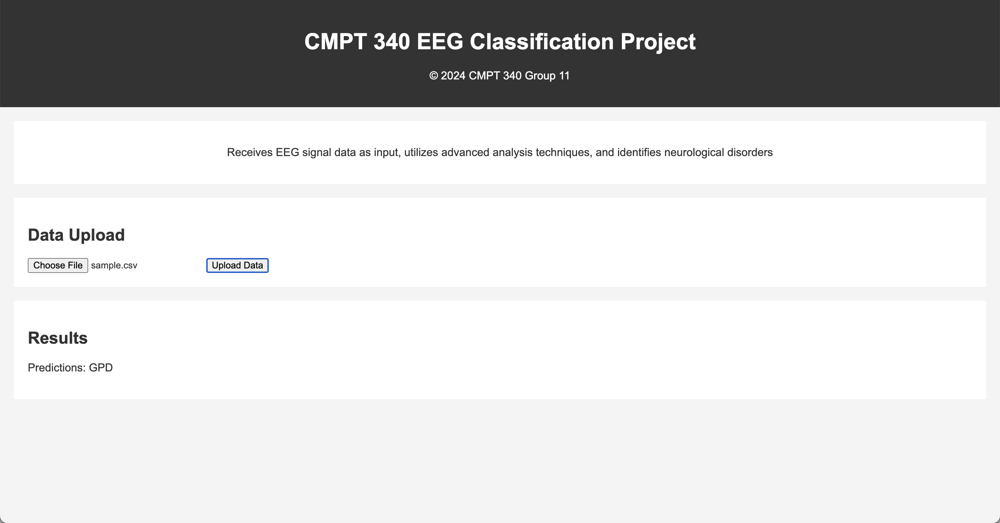

# Harmful Brain Activity Classification (HBAC)

This model aims to classify seizures and other patterns of harmful brain activity in critically ill patients. We'll be using data provided by Harvard Medical School, as part of an ongoing [Kaggle competition](https://www.kaggle.com/competitions/hms-harmful-brain-activity-classification/overview).
## Important Links

| [Timesheet](https://1sfu-my.sharepoint.com/:x:/g/personal/hamarneh_sfu_ca/EZzEiGQNT3FAphR788z3IrYBEx8ASZ6C2IbP5BXt9pfhCg?e=dp9ZUx) | [Slack channel](https://app.slack.com/client/T06AP91EYG6/C06DW516NA1?selected_team_id=T06AP91EYG6) | [Project report](https://www.overleaf.com/7196966197swyzqqdqbkxt#c96211) |
|-----------|---------------|-------------------------|

## Video/demo/GIF
For the demonstration, we created a web interface that identifies neurological disorders and displays the output to users upon receiving data input. We used Python flask, which stores our HTML files and serves as the location for our Python code. Once we put the single data file as a CSV file and upload the data, the analysis result shows at the bottom ['GPD,' 'GRDA,' 'LPD,' 'LRDA,' 'Other,' 'Seizure']. 

[](https://www.youtube.com/watch?v=XXy3TBCCN7k)

## Table of Contents
1. [Demo](#demo)

2. [Installation](#installation)

3. [Reproducing this project](#repro)

4. [Guidance](#guide)


<a name="demo"></a>
## 1. Example demo

A minimal example to showcase your work




### What to find where

Explain briefly what files are found where

```bash
repository
├── src                          ## source code of the package itself
├── scripts                      ## scripts, if needed
├── docs                         ## If needed, documentation   
├── README.md                    ## You are here
├── requirements.yml             ## If you use conda
```

<a name="installation"></a>

## 2. Installation

Provide sufficient instructions to reproduce and install your project. 
Provide _exact_ versions, test on CSIL or reference workstations.

```bash
git clone $THISREPO
cd $THISREPO
conda env create -f requirements.yml
conda activate amazing
```

<a name="repro"></a>
## 3. Reproduction
Demonstrate how your work can be reproduced, e.g. the results in your report.
```bash
mkdir tmp && cd tmp
wget https://yourstorageisourbusiness.com/dataset.zip
unzip dataset.zip
conda activate amazing
python evaluate.py --epochs=10 --data=/in/put/dir
```
Data can be found at ...
Output will be saved in ...

<a name="guide"></a>
## 4. Guidance

- Use [git](https://git-scm.com/book/en/v2)
    - Do NOT use history re-editing (rebase)
    - Commit messages should be informative:
        - No: 'this should fix it', 'bump' commit messages
        - Yes: 'Resolve invalid API call in updating X'
    - Do NOT include IDE folders (.idea), or hidden files. Update your .gitignore where needed.
    - Do NOT use the repository to upload data
- Use [VSCode](https://code.visualstudio.com/) or a similarly powerful IDE
- Use [Copilot for free](https://dev.to/twizelissa/how-to-enable-github-copilot-for-free-as-student-4kal)
- Sign up for [GitHub Education](https://education.github.com/) 
